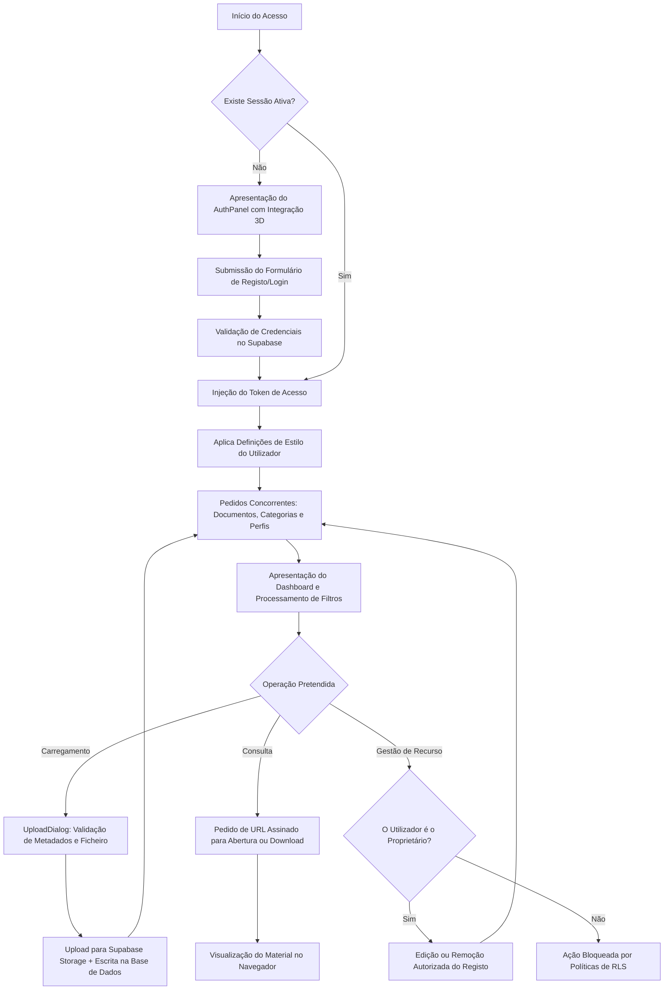

# Manual de Arquitetura e Funcionamento - ETAP Biblioteca

Este documento apresenta a especificação técnica e o manual de funcionamento do sistema ETAP Biblioteca. Foi elaborado de forma a descrever detalhadamente todas as tecnologias, componentes e fluxos operacionais da aplicação, servindo como guia de integração tanto para programadores iniciantes como para utilizadores que pretendam compreender a arquitetura subjacente.

---

## 1. Descrição Geral do Sistema

A ETAP Biblioteca é uma plataforma web orientada para a partilha, organização e centralização de recursos pedagógicos e materiais de estudo, tais como documentos em formato PDF, vídeos, apresentações e arquivos comprimidos.

Os pilares fundamentais da plataforma incluem:
* **Autenticação Institucional:** O registo e início de sessão são restritos a utilizadores com endereços de correio eletrónico associados ao domínio institucional @etap.pt.
* **Segurança de Autoria (Row Level Security - RLS):** Garante-se que todos os utilizadores autenticados possam ler e descarregar os materiais, mas apenas o utilizador que efetuou o carregamento (dono do recurso) possui permissões para modificar ou eliminar os respetivos registos e ficheiros.
* **Personalização de Interface Avançada:** O sistema disponibiliza uma experiência altamente customizável através da alteração dinâmica de tipos de letra, dimensão do texto e aplicação de múltiplos temas visuais (incluindo temas com fundos gradientes animados).

---

## 2. Pilha Tecnológica (Stack Tecnológico)

O desenvolvimento da aplicação assenta numa arquitetura moderna de aplicações web de página única (Single Page Application - SPA) com renderização híbrida:

| Componente | Tecnologia | Finalidade e Justificação Técnica |
| :--- | :--- | :--- |
| **Framework Principal** | Next.js 15 (React) | Permite estruturar o projeto com base em componentes reutilizáveis, beneficiando de renderização eficiente do lado do cliente através da diretiva `"use client"` e gestão inteligente de dependências. |
| **Linguagem** | TypeScript | Introduz tipagem estática ao ecossistema JavaScript, mitigando erros em tempo de compilação, facilitando a autodescoberta de propriedades e melhorando a manutenibilidade do código. |
| **Estilização** | Tailwind CSS | Framework de CSS utilitário para o desenvolvimento acelerado de interfaces responsivas. Facilita o mapeamento direto de variáveis de estilo personalizadas (CSS Variables) para controlo centralizado de temas. |
| **Backend as a Service** | Supabase | Solução de infraestrutura que disponibiliza um serviço de autenticação de utilizadores, uma base de dados relacional PostgreSQL e um sistema de armazenamento de objetos em disco (Storage). |
| **Biblioteca de Ícones** | Lucide React | Fornece uma coleção abrangente de vetores SVG expostos como componentes React, mantendo a consistência visual de toda a aplicação. |
| **Integração 3D** | Spline Viewer | Componente autónomo para carregamento e renderização em tempo real de cenários tridimensionais no ecrã de entrada, proporcionando uma experiência imersiva e interativa. |

---

## 3. Arquitetura de Ficheiros e Componentes Implementadas

O projeto organiza-se através de módulos complementares que interagem sistematicamente para gerir o estado global da aplicação:

### Estrutura de Inicialização

#### layout.tsx e page.tsx
* **layout.tsx:** Define a estrutura global do documento HTML, injetando as fontes tipográficas necessárias e garantindo o invólucro do viewport da aplicação.
* **page.tsx:** Representa o ponto de entrada da rota raiz, sendo responsável por invocar o componente principal `<LibraryApp />`.

#### library-app.tsx
* **Gestão de Estado de Sessão:** Comunica diretamente com a API do Supabase para verificar se existe uma sessão ativa de utilizador aquando da inicialização da aplicação.
* **Carregamento Assíncrono:** Apresenta um indicador visual de carregamento dinâmico ("a preparar...") enquanto as credenciais do utilizador são validadas.
* **Encaminhamento de Acesso:** Se o utilizador não se encontrar autenticado, renderiza a página de login `<AuthPanel />`. Caso contrário, renderiza o ambiente principal `<Dashboard />`.
* **Inicialização Estética:** Carrega as configurações de interface gravadas em persistência local (`localStorage`). Se o utilizador terminar a sessão, força a reposição para o tema padrão institucional.

---

### Módulo de Acesso e Autenticação

#### auth-panel.tsx
* **Interface de Entrada:** Divide o ecrã em duas áreas lógicas principais. A área de visualização tridimensional dinamicamente carregada com a biblioteca Spline 3D (oculta em dispositivos móveis para preservação de largura de banda e capacidade de processamento) e o formulário de controlo de acessos.
* **Validação de Mensagens:** Analisa os parâmetros de URL e os fragmentos de hash para identificar e expor mensagens de confirmação de email ou de erro retornadas pelo servidor de autenticação.

#### auth-dialog.tsx
* **Processamento de Credenciais:** Contém os formulários detalhados para os métodos de registo de novas contas e início de sessão de utilizadores existentes.
* **Regras de Validação:** Restringe o envio de pedidos que não correspondam aos critérios definidos, informando claramente o utilizador através de notificações de estado em caso de falha de credenciais ou problemas de conectividade.

---

### Módulo Principal do Dashboard

#### dashboard.tsx
* **Coordenação de Dados:** Centraliza os pedidos de dados (fetch) e os respetivos estados de carregamento. Utiliza a paralelização de consultas à base de dados através de `Promise.all` para obter simultaneamente a informação dos documentos, das categorias e do perfil do utilizador.
* **Pipeline de Filtragem:** Filtra dinamicamente em memória a lista de documentos com base em múltiplos critérios cumulativos: a pesquisa textual, a categoria de navegação ativa e a tag selecionada.
* **Gestão de Eventos:** Define funções de retorno de chamada (callbacks) para atualizar a lista local de materiais imediatamente após operações de criação, modificação ou eliminação, evitando chamadas repetidas desnecessárias à rede.

#### sidebar.tsx
* **Painel Informativo Lateral:** Consolida a informação de navegação e as métricas do utilizador.
* **Cálculo de Métricas:** Apresenta estatísticas obtidas em tempo real a partir dos documentos carregados, incluindo a contagem global, os ficheiros propriedade do utilizador logado e o volume de armazenamento somado de todos os ficheiros ativos.
* **Listas de Navegação:** Exibe dinamicamente todas as categorias de materiais configuradas no sistema e renderiza as tags presentes nos materiais de forma a permitir uma navegação temática acelerada.

#### topbar.tsx
* **Barra de Navegação Superior:** Aloja as ações imediatas e a barra de pesquisa do utilizador.
* **Pesquisa Avançada com Autocompletar:** Implementa uma lógica de correspondência que varre em tempo real a coleção de documentos (pesquisando em títulos, descrições e nomes de ficheiros), a lista de categorias e a coleção de tags para gerar sugestões divididas em secções bem identificadas.
* **Navegação via Teclado:** Suporta o manuseamento completo através das teclas direcionais (setas superior e inferior), tecla `Enter` para confirmação e tecla `Escape` para encerramento do painel de sugestões.

---

### Módulo de Documentação e Ficheiros

#### document-card.tsx
* **Representação de Recursos:** Expõe de forma estruturada os metadados de cada recurso físico guardado, incluindo o tipo de ficheiro, tamanho legível, data de registo e o autor que o partilhou.
* **Segurança na Transferência:** Realiza chamadas à API do Supabase Storage para obter links de acesso temporários e assinados para a leitura ou descarga dos recursos, impedindo a exposição pública e direta dos caminhos internos de armazenamento.
* **Controlo de Permissões Visual:** Exibe os controlos de edição e remoção exclusivamente se o identificador do utilizador autenticado for correspondente ao do criador do registo.

#### upload-dialog.tsx
* **Carregamento de Novos Recursos:** Gere o ciclo de envio de ficheiros para a infraestrutura do Supabase.
* **Área de Transferência:** Fornece um painel de interação baseado em arrastamento com indicação de progresso de upload em tempo real (em formato percentual).
* **Validações do Lado do Cliente:** Impede a submissão de ficheiros vazios ou que ultrapassem o limite regulamentar estipulado de 500 Megabytes por ficheiro.

---

## 4. Persistência de Dados e Segurança do Backend

A segurança da plataforma é controlada de forma estrita e centralizada na infraestrutura de backend da base de dados PostgreSQL, mitigando riscos de segurança mesmo que a aplicação cliente seja comprometida:

### Políticas de Segurança ao Nível da Linha (Row Level Security - RLS)
A base de dados possui regras declarativas que definem os direitos de acesso de cada utilizador:

```sql
-- Exemplo conceptual da política RLS aplicada na tabela de documentos

-- 1. Qualquer utilizador autenticado pode consultar materiais
CREATE POLICY "Permitir leitura global a utilizadores autenticados" 
ON public.documents FOR SELECT 
TO authenticated 
USING (true);

-- 2. Qualquer utilizador autenticado pode inserir novos registos
CREATE POLICY "Permitir inserção a utilizadores autenticados" 
ON public.documents FOR INSERT 
TO authenticated 
WITH CHECK (auth.uid() = owner_id);

-- 3. Apenas o autor do registo pode atualizar ou remover o mesmo
CREATE POLICY "Permitir modificação apenas ao proprietário" 
ON public.documents FOR ALL 
TO authenticated 
USING (auth.uid() = owner_id)
WITH CHECK (auth.uid() = owner_id);
```

Este modelo descentralizado de controlo garante que as operações de escrita dependam exclusivamente da identidade validada pelo token de segurança gerado no ato de autenticação.

---

## 5. Funcionamento do Motor de Estilos e Customização Dinâmica

A aplicação recorre a um mapeamento dinâmico de variáveis CSS para aplicar os diversos temas estéticos.

### Estrutura de Gestão de Temas (settings.ts)
Cada tema possui um conjunto específico de mapeamento de variáveis, aplicado diretamente ao elemento raiz do documento HTML (`document.documentElement`):

```typescript
export const THEMES: ThemeDef[] = [
  {
    id: "etap-default",
    label: "Etap Default",
    description: "GitHub-brutalist dark palette",
    swatch: "#2f81f7",
    bgSwatch: "#0d1117",
    vars: {
      "--bg":       "#0d1117",
      "--bg-2":     "#161b22",
      "--border":   "#30363d",
      "--fg":       "#e6edf3",
      "--accent":   "#2f81f7",
    },
  },
  // Outros temas da aplicação
];
```

### Processamento de Temas Gradientes (Aurora, Dusk, Synthwave, Prism)
* **Ativação:** Quando um tema gradiente é selecionado, a aplicação adiciona a classe `gradient-active` ao elemento `body` do documento.
* **Transição Fluida:** É executada uma animação keyframe (`background-position` e `background-size`) que movimenta o gradiente ao longo do fundo da aplicação de forma impercetível e contínua.
* **Transparência de Painéis:** Os painéis laterais e superiores ajustam automaticamente os seus valores de opacidade através do mapeamento de classes dinâmicas, permitindo a visibilidade controlada do gradiente de fundo sem comprometer a legibilidade do texto.

---

## 6. Fluxo Geral de Navegação e Interação

O diagrama seguinte descreve a sequência lógica de operações efetuadas na plataforma:



Este fluxo integrado de componentes assegura uma experiência fluida, minimizando transferências de dados redundantes e otimizando a responsividade da ETAP Biblioteca em todos os cenários de utilização.
