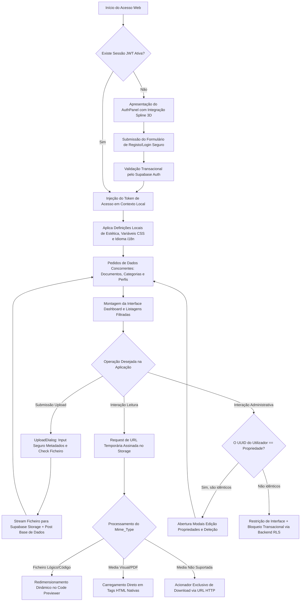

# Manual de Arquitetura e Funcionamento - ETAP Biblioteca

Este documento apresenta a especificação técnica e o manual de funcionamento do sistema ETAP Biblioteca. Foi elaborado para descrever detalhadamente as tecnologias, componentes e fluxos operacionais da aplicação, servindo como guia para programadores e utilizadores.

---

## 1. Descrição Geral do Sistema

A ETAP Biblioteca é uma plataforma web para partilha, organização e centralização de recursos pedagógicos e materiais de estudo. Suporta múltiplos formatos (PDFs, imagens, vídeos, arquivos e código-fonte) com capacidades avançadas de visualização integradas.

Principais pilares da plataforma:
* **Autenticação Institucional:** Acesso restrito a contas com domínio `@etap.pt`.
* **Segurança de Autoria (RLS):** Controlo de permissões rigoroso na base de dados, garantindo que apenas o proprietário pode editar ou remover recursos.
* **Visualização Avançada:** Pré-visualização integrada de ficheiros multimédia e código-fonte diretamente na aplicação, minimizando downloads externos.
* **Internacionalização (i18n):** Suporte nativo e comutável dinamicamente entre múltiplos idiomas (Português e Inglês).
* **Personalização de Interface:** Controlo total e imediato sobre temas estéticos (escuros, claros ou animados), tipos de letra e dimensões textuais.

---

## 2. Pilha Tecnológica (Stack Tecnológico)

Arquitetura moderna de Single Page Application (SPA) com renderização híbrida:

| Componente | Tecnologia | Finalidade e Justificação Técnica |
| :--- | :--- | :--- |
| **Framework Principal** | Next.js 15 (React) | Renderização do lado do cliente (`use client`) e gestão eficiente de dependências num ecossistema moderno focado em performance. |
| **Linguagem** | TypeScript | Tipagem estática, garantindo segurança em tempo de compilação e melhorando a autodescoberta e manutenção do código. |
| **Estilização** | Tailwind CSS | Framework utilitária, perfeitamente acoplada e mapeada por variáveis CSS para permitir alterações e controlos dinâmicos de temas. |
| **Backend as a Service** | Supabase | Infraestrutura integral que fornece Autenticação, Base de Dados relacional PostgreSQL e Storage (armazenamento fiável de objetos físicos). |
| **Biblioteca de Ícones** | Lucide React | Consistência visual através de componentes vetoriais SVG escaláveis e leves. |
| **Visualizador 3D** | Spline Viewer | Integração independente no ecrã inicial para carregamento de modelos 3D interativos e envolventes. |
| **Processamento de Código** | highlight.js & marked | Motores dedicados para deteção e colorização de sintaxe em tempo real (Syntax Highlighting) e renderização de formatações Markdown seguras (GFM). |

---

## 3. Funcionalidades Detalhadas

### 3.1. Gestão e Visualização de Documentos
* **Carregamento (Upload):** Os utilizadores podem transferir ficheiros através de interações clássicas ou *drag-and-drop*. Inclui indicadores visuais de progresso percentual de transferência.
* **Edição e Eliminação:** Apenas o autor original, com a sua conta validada, tem permissão de interface e de base de dados para alterar os metadados (como nome, descrição, categoria, tags) ou apagar o registo definitivo.
* **Visualizador Multimédia Integrado:** 
  * Imagens, vídeos e ficheiros PDF são apresentados nativamente dentro de um modal responsivo (`document-view-dialog.tsx`) não requerendo programas de terceiros.
  * O acesso direto ao ficheiro é intermediado pela geração de "Signed URLs" temporários na API do Supabase Storage. Isto restringe acessos forjados ou atalhos indevidos.

### 3.2. Visualizador Avançado de Código (Code Previewer)
* **Deteção Multi-linguagem:** Identificação inteligente da linguagem pela extensão de ficheiro ou convenção de nome (ex: `Dockerfile`, `Makefile`), abrangendo dezenas de linguagens suportadas pelo `highlight.js`.
* **Modo Expansível (Fullscreen):** Capacidade de expandir as linhas de código com um único clique de forma a preencher virtualmente toda a resolução útil do ecrã (`code-preview-overlay` via overlay), imitando um Editor IDE e suspendendo o rolamento (scroll) da página base.
* **Integração de Markdown:** Para ficheiros `.md`, os utilizadores podem alternar instantaneamente entre a visualização do código-fonte não formatado (*Raw Source*) ou o documento renderizado.
* **Ferramentas de Conveniência:** Integra cópia nativa instantânea para área de transferência (*clipboard*) e botão interativo de formatação para limites de linha (`Word Wrap`).

### 3.3. Pesquisa e Navegação Inteligente
* **Omnibox Dinâmica (Barra de Pesquisa Superior):** A pesquisa verifica paralela e simultaneamente títulos, descrições, extensões, categorias e *tags*. Os resultados preenchem imediatamente uma lista suspensa organizada logicamente.
* **Atalhos e Acessibilidade:** Interface fluída navegável com teclas de direção (`Up/Down`), seleção direta (`Enter`) e retrocesso (`Esc`).
* **Painel Informativo (Sidebar):** Contadores estatísticos que efetuam um inventário e mostram totais (contagem agregada e soma gigabytes) da conta local contra toda a plataforma. 

### 3.4. Internacionalização (i18n) e Definições de Estilo (Settings)
* **Tradução Local:** Recurso ao utilitário interno `useLanguage` suportado pelo inventário `translations.ts` que reflete num instante alterações vocabulares em toda a SPA sem obrigar a refrescos da rede.
* **Memória Temática:** As preferências aplicadas (Tipografia Sans/Serif/Mono, tamanhos padronizados de texto `sm/base/lg` e esquemas visuais com ou sem gradientes animados em background) são mapeadas para o `document.documentElement` em variáveis CSS injetadas em tempo real e imortalizadas localmente via `localStorage`.

---

## 4. Arquitetura de Componentes da Aplicação

### Núcleo de Inicialização e Autenticação
* `layout.tsx` / `page.tsx`: Fundações de entrada do React Next.js, incluindo o *wrapper* base com metadados HTML, classes fundamentais e definições font-face.
* `library-app.tsx`: O cérebro controlador do estado. Deteta a existência de um *Token* do Supabase e encarrega-se do roteamento principal, servindo ecrãs de registo a não autenticados ou ativando a zona de trabalho àqueles com login válido.
* `auth-panel.tsx` / `auth-dialog.tsx`: Formulários completos com submissões em lote à API, tratamento global de respostas de ecrã e *handlers* de verificação de conta ou reset de passwords.

### Interface de Utilização Central (Dashboard)
* `dashboard.tsx`: Gestor da grelha documental de listagem. Sincroniza estados cruzados com o painel lateral para efetuar filtragens e emite `Promises.all` para chamadas eficientes em rede aquando do carregamento da montra de ficheiros e subcategorias.
* `sidebar.tsx`: Acomoda os filtros principais interativos baseados nas *tags* submetidas por toda a plataforma.
* `topbar.tsx`: Contém a zona utilitária superior que engloba perfis de utilizador (`Avatar` interativo e logout) e a pesquisa inteligente.

### Operações e Visualização de Ficheiros
* `document-card.tsx`: Estrutura padronizada (cartão com sombra, rodapé metadados, selos visuais). Expõe interfaces dinâmicas restritas ao autor do ficheiro para aceder a modais de deleção ou gestão de ficheiro.
* `document-view-dialog.tsx`: Um contentor Modal com arquitetura reativa que, perante chamadas de pré-visualização ou downloads, inspeciona o `mime_type` providenciado para despachar o renderizador específico (IFrame PDF, tag de Video, Imagem). Transita elegantemente de metragens estreitas para espaços mais alongados se invocado para visualizar trechos de código.
* `code-preview.tsx`: Focado estritamente na leitura otimizada de linguagens formais e estruturadas. Renderiza via `dangerouslySetInnerHTML` após aplicar *parsers* (Highlight e Marked), controlando localmente estados de visualização integral e quebra de linhas para legibilidade ininterrupta.
* `upload-dialog.tsx`: Valida aspetos estruturais de um pedido de ficheiro como dimensão máxima e preenchimento de campos essenciais (título, descrição, categorias em dropdown), enviando sequencialmente os dados transacionais para o *Storage Bucket* e depois para o *Database Table*.

---

## 5. Persistência de Dados e Segurança do Backend (RLS)

A base de dados Postgres alavancada no Supabase encarrega-se de blindar de forma hermética a segurança global da solução, empregando `Row Level Security` (RLS). Com isto, as API REST em GraphQL tornam-se virtualmente imunes a comandos maliciosos diretos.

**Exemplo das Políticas de Acesso Declaradas:**
```sql
-- 1. Qualquer utilizador autenticado pode consultar materiais (DQL Universal)
CREATE POLICY "Permitir leitura global a utilizadores autenticados" 
ON public.documents FOR SELECT TO authenticated USING (true);

-- 2. Qualquer utilizador autenticado pode inserir novos registos (DML Criação)
CREATE POLICY "Permitir inserção a utilizadores autenticados" 
ON public.documents FOR INSERT TO authenticated WITH CHECK (auth.uid() = owner_id);

-- 3. Apenas o autor do registo pode atualizar ou remover o mesmo (DML Modificação)
CREATE POLICY "Permitir modificação apenas ao proprietário" 
ON public.documents FOR ALL TO authenticated USING (auth.uid() = owner_id) WITH CHECK (auth.uid() = owner_id);
```

As políticas garantem que a modificação dos dados depende de fatores de avaliação da identidade do requerente encriptada no *Token JWT* emitido em cada sessão autenticada.

---

## 6. Fluxo Geral de Navegação e Interação

O diagrama em formato de grafo direcionado aprofunda o processo transacional completo de um utilizador no ecossistema:


```mermaid
graph TD
    A[Início do Acesso Web] --> B{Existe Sessão JWT Ativa?}
    B -- Não --> C[Apresentação do AuthPanel com Integração Spline 3D]
    C --> D[Submissão do Formulário de Registo/Login Seguro]
    D --> E[Validação Transacional pelo Supabase Auth]
    E --> F[Injeção do Token de Acesso em Contexto Local]
    B -- Sim --> F
    F --> G[Aplica Definições Locais de Estética, Variáveis CSS e Idioma i18n]
    G --> H[Pedidos de Dados Concorrentes: Documentos, Categorias e Perfis]
    H --> I[Montagem da Interface Dashboard e Listagens Filtradas]
    I --> J{Operação Desejada na Aplicação}
    J -- Submissão Upload --> K[UploadDialog: Input Seguro Metadados e Check Ficheiro]
    K --> L[Stream Ficheiro para Supabase Storage + Post Base de Dados]
    L --> H
    J -- Interação Leitura --> M[Request de URL Temporária Assinada no Storage]
    M --> N{Processamento do Mime_Type}
    N -- Ficheiro Lógico/Código --> O1[Redimensionamento Dinâmico no Code Previewer]
    N -- Media Visual/PDF --> O2[Carregamento Direto em Tags HTML Nativas]
    N -- Media Não Suportada --> O3[Acionador Exclusivo de Download via URL HTTP]
    J -- Interação Administrativa --> P{O UUID do Utilizador == Propriedade?}
    P -- Sim, são idênticos --> Q[Abertura Modais Edição Propriedades e Deleção]
    Q --> H
    P -- Não idênticos --> R[Restrição de Interface + Bloqueio Transacional via Backend RLS]
```

Este fluxo global traduz a arquitetura defensiva e reativa que o sistema ETAP Biblioteca confere às operações diárias da plataforma, mantendo alta a estabilidade sem sacrificar a flexibilidade estática.

# Overview da Arquiteture (Visão Técnica)

# ETAP Biblioteca - Technical Architecture & Operations Manual

## Table of Contents

1. [System Overview](#1-system-overview)
2. [Technology Stack](#2-technology-stack)
3. [System Architecture](#3-system-architecture)
4. [Component Specifications](#4-component-specifications)
5. [Data Management & Persistence](#5-data-management--persistence)
6. [Authentication & Authorization](#6-authentication--authorization)
7. [Security Implementation](#7-security-implementation)
8. [User Interface & Experience](#8-user-interface--experience)
9. [Operational Flows](#9-operational-flows)
10. [Performance Optimization](#10-performance-optimization)
11. [Deployment & Maintenance](#11-deployment--maintenance)
12. [Troubleshooting Guide](#12-troubleshooting-guide)

---

## 1. System Overview

### 1.1 Purpose & Scope

ETAP Biblioteca is a comprehensive web-based platform engineered to serve as a centralized repository for educational resources and study materials. The system facilitates the organization, sharing, and management of pedagogical content across multiple formats including documents, images, videos, archives, and source code.

### 1.2 Core Capabilities

The platform delivers the following primary functionalities:

- **Secure Authentication**: Institutional email verification (`@etap.pt`) with role-based access control
- **Content Management**: Upload, edit, and deletion operations with strict ownership validation
- **Advanced Preview**: Integrated visualization of multimedia content and source code
- **Intelligent Search**: Multi-dimensional query matching across metadata and content
- **Internationalization**: Complete bilingual support (Portuguese/English)
- **Interface Customization**: Dynamic theme management with accessibility controls

### 1.3 System Boundaries

The solution operates within the following constraints:

- Restricted to authenticated users with institutional credentials
- Storage capacity governed by Supabase quotas
- Maximum file size limitation: 500 MB per upload
- Supported document formats: PDF, images (PNG, JPG, WEBP, GIF), video, archives, and source code

---

## 2. Technology Stack

### 2.1 Frontend Framework

**Next.js 15 (React)**
The application employs Next.js as the foundational framework, leveraging client-side rendering (`use client` directives) for interactive components. The framework provides:

- Optimized bundle loading through automatic code splitting
- Efficient state management via React hooks
- Type-safe development with TypeScript integration

**TypeScript**
The codebase is fully typed, ensuring compile-time validation of data structures, function signatures, and component props. This enables:

- Enhanced IDE autocompletion and error detection
- Reduced runtime type errors
- Improved code maintainability and refactoring safety

### 2.2 Styling & Theming

**Tailwind CSS**
A utility-first CSS framework integrated with custom CSS variables for dynamic theme management. The architecture supports:

- Runtime theme switching without full page reloads
- Accessibility enhancements through semantic class naming
- Responsive design patterns

### 2.3 Backend Services

**Supabase**
A comprehensive Backend-as-a-Service providing:

- **Authentication**: JWT-based session management with email/password flow
- **PostgreSQL Database**: Relational data storage with Row Level Security (RLS)
- **Object Storage**: Scalable file storage with signed URL generation

### 2.4 Preview & Rendering

**highlight.js & marked**
Integrated for code syntax highlighting and Markdown rendering:

- **highlight.js**: Real-time syntax detection with support for 190+ programming languages
- **marked**: Markdown parser with GitHub Flavored Markdown (GFM) support

**Spline Viewer**
A WebGL-based 3D scene renderer for the landing page authentication interface.

### 2.5 Iconography

**Lucide React**
A lightweight SVG icon library providing consistent visual language across the application.

---

## 3. System Architecture

### 3.1 Component Hierarchy

The application follows a modular architecture organized around functional responsibilities:

```
┌─────────────────────────────────────────────────────────────┐
│                      LibraryApp                           │
│  ┌───────────────────────────────────────────────────────┐ │
│  │                  LanguageProvider                     │ │
│  │  ┌─────────────────────────────────────────────────┐  │ │
│  │  │                 ToastProvider                   │  │ │
│  │  │  ┌───────────────────────────────────────────┐  │  │ │
│  │  │  │           LibraryAppInner                 │  │  │ │
│  │  │  │  ┌─────────────────────────────────────┐  │  │  │ │
│  │  │  │  │         AuthPanel                   │  │  │  │ │
│  │  │  │  │         or Dashboard                │  │  │  │ │
│  │  │  │  └─────────────────────────────────────┘  │  │  │ │
│  │  │  └───────────────────────────────────────────┘  │  │ │
│  │  └─────────────────────────────────────────────────┘  │ │
│  └───────────────────────────────────────────────────────┘ │
└─────────────────────────────────────────────────────────────┘
```

### 3.2 State Management

The application employs a combination of state management strategies:

- **React Context**: Used for global state including language preferences and toast notifications
- **Local State**: Component-specific state managed with `useState` and `useReducer`
- **Persistent State**: User preferences stored in `localStorage` for settings persistence
- **Server State**: Managed by Supabase with automatic session restoration

### 3.3 Data Flow Architecture

```
┌────────────┐    ┌─────────────┐    ┌─────────────┐
│   Client   │◄──►│  UI Layer   │◄──►│  State      │
│  Components│    │  (React)    │    │  Management │
└─────┬──────┘    └─────────────┘    └──────┬──────┘
      │                                      │
      │                                      │
      ▼                                      ▼
┌─────────────────────────────────────────────────────┐
│                Supabase API Layer                   │
│  ┌────────────────────────────────────────────┐    │
│  │  Authentication   │   Database   │ Storage │    │
│  └────────────────────────────────────────────┘    │
└─────────────────────────────────────────────────────┘
```

---

## 4. Component Specifications

### 4.1 Core Application Components

#### LibraryApp (`library-app.tsx`)

**Purpose**: Root application component responsible for initialization and routing.

**Responsibilities**:
- Session management with Supabase authentication
- Settings application and persistence
- Theme switching between landing and authenticated states
- Background canvas rendering for dynamic effects

**Key Functions**:
- `useEffect` hooks for session state synchronization
- Settings loading and application via `applySettings()`
- Canvas activation based on theme configuration

**Data Dependencies**:
- `session`: Supabase user session
- `settings`: Application configuration from localStorage

#### Dashboard (`dashboard.tsx`)

**Purpose**: Primary authenticated interface for content management.

**Responsibilities**:
- Document listing with filtering and sorting
- Search interface coordination
- Dialog management (upload, edit, view, settings)
- Drag-and-drop file handling
- Keyboard shortcut management

**Data Dependencies**:
- `documents`: Array of LibraryDocument objects
- `categories`: Categorization taxonomy
- `profile`: User metadata
- `session`: Active authentication session

**Key Functions**:
- `loadData()`: Concurrent data fetching with Promise.all
- `handleDelete()`: Document removal with optimistic UI update
- `handleUploaded()`: Post-upload refresh with toast notification

#### Topbar (`topbar.tsx`)

**Purpose**: Global navigation and search interface.

**Responsibilities**:
- Omnibox search with typeahead suggestions
- Keyboard navigation (⌘K to focus)
- Action buttons (refresh, settings, upload)
- Search result categorization

**Data Dependencies**:
- `documents`: For search indexing
- `categories`: For category suggestions
- `tags`: For tag-based autocomplete

**Search Algorithm**:
The search performs substring matching across multiple document fields:
1. Title
2. Description (optional)
3. File name
4. Category name
5. Tags

Results are grouped by type: documents, categories, tags.

### 4.2 Document Management Components

#### DocumentCard (`document-card.tsx`)

**Purpose**: Document preview and action component.

**Display Modes**:
- **Full Mode**: Detailed view with description, metadata, and action buttons
- **Compact Mode**: Minimal display for dense view

**Action Capabilities**:
- View document (opens preview dialog)
- Download (generates signed URL)
- Copy link (URL to clipboard)
- Edit (owner only)
- Delete (owner only with confirmation)

**Security Features**:
- Owner validation for destructive operations
- Confirmation dialog for deletion
- Busy state management to prevent double-submission

#### DocumentViewDialog (`document-view-dialog.tsx`)

**Purpose**: Modal document preview with advanced rendering.

**Preview Capabilities**:
- **Images**: Native HTML img with responsive sizing
- **Video**: HTML5 video element with controls
- **PDF**: Iframe embedding with toolbar removal
- **Code**: Syntax-highlighted source code display
- **Text**: Plain text with monospace formatting

**Content Processing**:
- **Discord-style Formatting**: Supports bold, italic, underline, strikethrough
- **Code Blocks**: Syntax-highlighted blocks with language detection
- **Inline Code**: Monospace formatting with background

**Render Pipeline**:
1. Signed URL generation via Supabase Storage
2. MIME type detection
3. Content-type specific rendering
4. Code content fetching for source files

#### CodePreview (`code-preview.tsx`)

**Purpose**: Advanced source code visualization.

**Features**:
- **Language Detection**: Extension-based identification with fallback
- **Syntax Highlighting**: highlight.js integration with 190+ languages
- **Line Numbers**: CSS counter-based numbering
- **Fullscreen Mode**: Expanded overlay for distraction-free viewing
- **Word Wrap**: Toggleable line wrapping
- **Markdown Rendering**: GitHub Flavored Markdown with syntax highlighting

**Performance Optimizations**:
- Content truncation at 512 KB for large files
- Memoized highlighted HTML
- Conditional rendering based on file type

**Language Mapping**:
Comprehensive extension-to-language mapping covering:
- JavaScript/TypeScript ecosystem
- Python, Java, C/C++, C#
- Web technologies (HTML, CSS, SCSS, XML)
- Data formats (JSON, YAML, TOML, INI)
- Scripting languages (Shell, Ruby, PHP, Perl)
- Database queries (SQL)
- Documentation formats (Markdown, LaTeX)

### 4.3 Upload & Management

#### UploadDialog (`upload-dialog.tsx`)

**Purpose**: File submission interface with validation.

**Upload Flow**:
1. File selection via drag-and-drop or file picker
2. Metadata input (title, description, category, tags)
3. Content filtering (profanity check)
4. File upload to Supabase Storage
5. Database record creation
6. Progress tracking and feedback

**Validation Rules**:
- Maximum file size: 500 MB
- Tag limits: 32 characters per tag, maximum 10 tags
- Profanity filtering: Blocked words in description and tags
- Required fields: Title, File

**Error Handling**:
- Upload failure: Automatic cleanup of orphaned storage files
- Database error: Rollback with user notification
- Validation errors: Field-level feedback

#### EditDocumentDialog (`edit-document-dialog.tsx`)

**Purpose**: Document metadata modification.

**Editable Fields**:
- Title
- Description
- Category
- Tags

**Security**:
- Owner validation before operation
- Content filtering on save
- Optimistic UI update on success

### 4.4 Authentication Components

#### AuthPanel (`auth-panel.tsx`)

**Purpose**: Landing page authentication interface.

**Layout**:
- Left panel: 3D Spline scene with branding
- Right panel: Authentication actions

**Components**:
- Login button with institutional email validation
- Registration button with form dialog
- Feature highlights and trust indicators
- Status notifications for verification

**Authentication Flow**:
1. Email validation (`@etap.pt` domain)
2. Password requirements (minimum 8 characters)
3. Supabase authentication API call
4. Session establishment on success

#### AuthDialog (`auth-dialog.tsx`)

**Purpose**: Authentication form modal.

**Modes**:
- Login: Email/password sign-in
- Register: New account creation with name field

**Password Management**:
- Show/hide toggle for security
- Minimum length validation (8 characters)
- Strength indicators

**Post-Authentication**:
- On successful registration: Display confirmation message
- On successful login: Close dialog, redirect to dashboard

#### AuthCallback (`auth-callback.tsx`)

**Purpose**: Email confirmation handler.

**Functionality**:
- Code exchange for session via Supabase
- Redirection to dashboard
- Graceful error handling for expired or pre-scanned links
- User notification for successful confirmation

### 4.5 Administration Components

#### AdminPanel (`admin-panel.tsx`)

**Purpose**: User and content administration interface.

**Tabs**:
1. **Users**: List of registered users with role management
2. **Invites**: Pending invitations with revocation
3. **Documents**: Global document catalog

**User Management**:
- Role display with color coding
- Document count per user
- Quick role modification via GrantRoleDialog

**Invite System**:
- Email-based invitations
- Role assignment at invitation time
- Revocation capability
- Audit trail (grantor, timestamp)

**Role Definitions**:
- **Member**: Basic user, can upload and manage own documents
- **Teacher**: Elevated privileges, can manage all documents
- **Admin**: Full system access, complete administrative capabilities

#### GrantRoleDialog (`grant-role-dialog.tsx`)

**Purpose**: Role assignment interface.

**Functionality**:
- Email input with validation
- Role selection from predefined options
- Permission preview based on selected role
- Supabase RPC call for role assignment

**Validation**:
- Email format verification
- Domain-agnostic (supports external emails)
- Duplicate grant prevention

### 4.6 Settings & Customization

#### SettingsDialog (`settings-dialog.tsx`)

**Purpose**: Comprehensive user preference management.

**Configuration Categories**:

| Section | Controls |
|---------|----------|
| Profile | Display name, bio, avatar, academic information |
| Account | Email, password, verification, data export, account deletion |
| Appearance | Theme selection, accent color, font, font size, density, accessibility |
| Privacy | Profile visibility, reading history, search history, session management |
| Library | Favorite categories, saved searches, reading lists |
| Security | Active sessions, login history, revocation |
| Language | Interface language, date format, time format, timezone |

**Settings Persistence**:
- localStorage key: `etap-settings-v1`
- Type-safe configuration object
- Versioned schema for forward compatibility

**Theme System**:
- Standard themes: Predetermined color schemes
- Gradient themes: Animated background gradients
- Effect themes: Procedural animations (Constellation, Starfield, Aurora, etc.)

**Accessibility Features**:
- High contrast mode
- Bold focus indicators
- Large touch targets
- Motion reduction
- Font size scaling

### 4.7 Background Effects

#### BackgroundCanvas (`background-canvas.tsx`)

**Purpose**: Procedural background animation system.

**Supported Effects**:

| Effect | Description | Performance |
|--------|-------------|-------------|
| Constellation | Drifting particle network with cursor interaction | Moderate |
| Starfield | Hyperspace warp simulation | Light |
| Matrix | Cascading katakana columns | Light |
| Aurora Flow | Multi-band flowing ribbons | Moderate |
| Plasma | Metabollic soft colour blobs | Moderate |
| Lightning | Branching electrical bolts with storm effects | Heavy |
| Sand Drift | Particles with curl noise wind field | Moderate |
| Neon Grid | WebGL2 raymarched corridor | Heavy |
| Fire Embers | Rising heat particles with turbulence | Moderate |

**Optimization Features**:
- `reduceMotion`: Disables animation loop
- `animationSpeed`: Multiplies per-frame delta time
- `particleDensity`: Scales particle counts (low/med/high)
- `visibilitychange`: Auto-pauses on tab switch
- DPR-aware resolution scaling

**Renderer Lifecycle**:
1. Factory creation with color palette
2. Resize handling for canvas dimension changes
3. Frame rendering with delta time
4. Disposal on theme/effect switch

---

## 5. Data Management & Persistence

### 5.1 Database Schema

**Documents Table**
```sql
CREATE TABLE documents (
  id          UUID PRIMARY KEY DEFAULT gen_random_uuid(),
  title       TEXT NOT NULL,
  description TEXT,
  file_name   TEXT NOT NULL,
  file_path   TEXT NOT NULL UNIQUE,
  file_size   BIGINT NOT NULL,
  mime_type   TEXT NOT NULL,
  owner_id    UUID NOT NULL REFERENCES profiles(id) ON DELETE CASCADE,
  category_id UUID REFERENCES categories(id) ON DELETE SET NULL,
  tags        TEXT[] DEFAULT '{}',
  created_at  TIMESTAMPTZ DEFAULT NOW(),
  updated_at  TIMESTAMPTZ DEFAULT NOW()
);
```

**Profiles Table**
```sql
CREATE TABLE profiles (
  id                    UUID PRIMARY KEY REFERENCES auth.users(id) ON DELETE CASCADE,
  email                 TEXT UNIQUE NOT NULL,
  full_name             TEXT,
  avatar_url            TEXT,
  role                  TEXT DEFAULT 'member' CHECK (role IN ('member','teacher','admin')),
  bio                   TEXT,
  course                TEXT,
  academic_year         TEXT,
  class_group           TEXT,
  profile_visibility    TEXT DEFAULT 'school' CHECK (profile_visibility IN ('school','staff','private')),
  show_reading_history  BOOLEAN DEFAULT TRUE,
  favorite_category_ids UUID[] DEFAULT '{}',
  deletion_requested_at TIMESTAMPTZ,
  created_at            TIMESTAMPTZ DEFAULT NOW(),
  updated_at            TIMESTAMPTZ DEFAULT NOW()
);
```

**Categories Table**
```sql
CREATE TABLE categories (
  id          UUID PRIMARY KEY DEFAULT gen_random_uuid(),
  name        TEXT NOT NULL,
  color       TEXT NOT NULL,
  icon        TEXT,
  description TEXT,
  created_at  TIMESTAMPTZ DEFAULT NOW()
);
```

**Invites Table**
```sql
CREATE TABLE invites (
  id           UUID PRIMARY KEY DEFAULT gen_random_uuid(),
  email        TEXT NOT NULL UNIQUE,
  role         TEXT NOT NULL CHECK (role IN ('member','teacher','admin')),
  granted_by   UUID NOT NULL REFERENCES profiles(id),
  granted_at   TIMESTAMPTZ DEFAULT NOW(),
  expires_at   TIMESTAMPTZ DEFAULT (NOW() + INTERVAL '30 days')
);
```

**User Sessions Table**
```sql
CREATE TABLE user_sessions (
  id              UUID PRIMARY KEY DEFAULT gen_random_uuid(),
  user_id         UUID NOT NULL REFERENCES profiles(id) ON DELETE CASCADE,
  device_id       TEXT NOT NULL,
  device_label    TEXT,
  user_agent      TEXT,
  last_seen_at    TIMESTAMPTZ DEFAULT NOW(),
  created_at      TIMESTAMPTZ DEFAULT NOW()
);
```

**Login History Table**
```sql
CREATE TABLE login_history (
  id              UUID PRIMARY KEY DEFAULT gen_random_uuid(),
  user_id         UUID NOT NULL REFERENCES profiles(id) ON DELETE CASCADE,
  device_id       TEXT NOT NULL,
  device_label    TEXT,
  user_agent      TEXT,
  ip_address      TEXT,
  occurred_at     TIMESTAMPTZ DEFAULT NOW()
);
```

**Reading History Table**
```sql
CREATE TABLE reading_history (
  id           UUID PRIMARY KEY DEFAULT gen_random_uuid(),
  user_id      UUID NOT NULL REFERENCES profiles(id) ON DELETE CASCADE,
  document_id  UUID NOT NULL REFERENCES documents(id) ON DELETE CASCADE,
  accessed_at  TIMESTAMPTZ DEFAULT NOW(),
  viewed_duration INTERVAL
);
```

**Saved Searches Table**
```sql
CREATE TABLE saved_searches (
  id          UUID PRIMARY KEY DEFAULT gen_random_uuid(),
  user_id     UUID NOT NULL REFERENCES profiles(id) ON DELETE CASCADE,
  label       TEXT NOT NULL,
  query       TEXT,
  category_id UUID REFERENCES categories(id) ON DELETE SET NULL,
  tag         TEXT,
  created_at  TIMESTAMPTZ DEFAULT NOW()
);
```

**Reading Lists Table**
```sql
CREATE TABLE reading_lists (
  id          UUID PRIMARY KEY DEFAULT gen_random_uuid(),
  user_id     UUID NOT NULL REFERENCES profiles(id) ON DELETE CASCADE,
  name        TEXT NOT NULL,
  description TEXT,
  created_at  TIMESTAMPTZ DEFAULT NOW()
);
```

### 5.2 Row Level Security Policies

**Documents Table Policies**

```sql
-- Global read access for authenticated users
CREATE POLICY "Permitir leitura global a utilizadores autenticados"
ON public.documents FOR SELECT
TO authenticated
USING (true);

-- Insert permission for authenticated users
CREATE POLICY "Permitir inserção a utilizadores autenticados"
ON public.documents FOR INSERT
TO authenticated
WITH CHECK (auth.uid() = owner_id);

-- Update permission: owner only
CREATE POLICY "Permitir modificação apenas ao proprietário"
ON public.documents FOR UPDATE
TO authenticated
USING (auth.uid() = owner_id)
WITH CHECK (auth.uid() = owner_id);

-- Delete permission: owner only
CREATE POLICY "Permitir eliminação apenas ao proprietário"
ON public.documents FOR DELETE
TO authenticated
USING (auth.uid() = owner_id);
```

**Profiles Table Policies**

```sql
-- Read access to own profile
CREATE POLICY "Users can view their own profile"
ON public.profiles FOR SELECT
TO authenticated
USING (auth.uid() = id);

-- Update access to own profile
CREATE POLICY "Users can update their own profile"
ON public.profiles FOR UPDATE
TO authenticated
USING (auth.uid() = id)
WITH CHECK (auth.uid() = id);

-- Admin read access
CREATE POLICY "Admins can view all profiles"
ON public.profiles FOR SELECT
TO authenticated
USING (
  EXISTS (
    SELECT 1 FROM profiles
    WHERE id = auth.uid() AND role = 'admin'
  )
);
```

### 5.3 Storage Architecture

**Bucket Configuration**
- **Name**: `biblioteca`
- **Access**: Authenticated users only
- **File Organization**: `{user_id}/{timestamp}-{filename}`

**Signed URL Generation**
- Temporary URLs with configurable expiry (120-300 seconds)
- Optional download parameter for forced download
- URL regeneration on each access request

**Security Measures**
- No public bucket access
- File paths prefixed with user ID for organization
- Automatic cleanup on document deletion
- MIME type validation on upload

---

## 6. Authentication & Authorization

### 6.1 Authentication Flow

```
┌──────────┐    ┌─────────────────┐    ┌─────────────────┐
│  User    │───►│  AuthPanel      │───►│  AuthDialog     │
│  Action  │    │  (Landing Page) │    │  (Login/Reg)    │
└──────────┘    └─────────────────┘    └────────┬────────┘
                                                │
                                                ▼
┌──────────┐    ┌─────────────────┐    ┌─────────────────┐
│  Success │◄───│  AuthCallback   │◄───│  Supabase Auth  │
│  Redirect│    │  (Confirmation) │    │  (API Call)     │
└──────────┘    └─────────────────┘    └─────────────────┘
```

### 6.2 Authorization Levels

**Role Hierarchy**:
```
Admin
  ├── Full CRUD operations on all documents
  ├── User management (invites, roles)
  ├── System-wide view access
  └── Administrative panel access

Teacher
  ├── CRUD operations on all documents
  ├── Invite management (grant/revoke)
  ├── View all user profiles
  └── Basic management access

Member (Default)
  ├── CRUD operations on own documents
  ├── View all documents
  ├── Profile management
  └── Personal settings configuration
```

### 6.3 Session Management

**Session Storage**:
- Supabase-managed JWT tokens
- Automatic refresh on expiry
- Client-side session context

**Session Features**:
- Device tracking for security
- Session revocation (individual or all)
- Login history auditing
- Current session identification

---

## 7. Security Implementation

### 7.1 Data Security

**Transport Security**:
- HTTPS enforced for all communications
- Supabase API endpoints secured with TLS

**Storage Security**:
- Files stored with UUID-based paths
- Signed URL generation prevents unauthorized access
- MIME type validation on upload
- File size limits (500 MB)

**Input Validation**:
- SQL injection prevention via Supabase client
- XSS mitigation through React's automatic escaping
- Content filtering for profanity

### 7.2 Authentication Security

**Password Policy**:
- Minimum 8 characters
- No character restrictions
- Secure hashing via Supabase Auth

**Account Protection**:
- Email verification required
- Rate limiting on auth attempts
- Session expiry

**Invite Security**:
- Email-based invitation
- Revocation capability
- Audit trail for creation

### 7.3 API Security

**Endpoint Protection**:
- RLS policies on all database operations
- Storage bucket policies
- User ID validation on operations

**Signed URL Generation**:
- Temporary access tokens
- Inability to forge or replay
- Expiration enforcement

---

## 8. User Interface & Experience

### 8.1 Layout Structure

**Authenticated Layout**:
```
┌─────────────────────────────────────────────────────┐
│  ┌───────────┐  ┌──────────────────────────────────┐│
│  │  Sidebar  │  │  Topbar                         ││
│  │           │  │  ┌───────────────────────────┐  ││
│  │  - Logo   │  │  │  Search                   │  ││
│  │  - User   │  │  │  ┌──────────┬──────────┐  │  ││
│  │  - Stats  │  │  │  │ Refresh  │ Settings │  │  ││
│  │  - Nav    │  │  │  └──────────┴──────────┘  │  ││
│  │  - Footer │  │  └───────────────────────────┘  ││
│  └───────────┘  │  ┌──────────────────────────────┐│
│                  │  │  SortViewBar                ││
│                  │  │  ┌────────────────────────┐ ││
│                  │  │  │  Sort Options  │ View  │ ││
│                  │  │  └────────────────────────┘ ││
│                  │  └──────────────────────────────┘│
│                  │  ┌──────────────────────────────┐│
│                  │  │  Document List              ││
│                  │  │  ┌────────────────────────┐  ││
│                  │  │  │ Document Card          │  ││
│                  │  │  ├────────────────────────┤  ││
│                  │  │  │ Document Card          │  ││
│                  │  │  └────────────────────────┘  ││
│                  │  └──────────────────────────────┘│
│                  └──────────────────────────────────┘│
└─────────────────────────────────────────────────────┘
```

### 8.2 Responsive Design

**Breakpoints**:
- **Mobile**: < 640px (Single column layout)
- **Tablet**: 640px - 1024px (Sidebar collapsible)
- **Desktop**: > 1024px (Full layout)

**Component Adaptations**:
- Sidebar: Slides in/out on mobile
- Topbar: Condensed action buttons on mobile
- Document Cards: Full vs Compact mode toggle
- Sort options: Icon-only on small screens

### 8.3 Accessibility Features

**Keyboard Navigation**:
- Full focus management
- Arrow key navigation in dropdowns
- Escape key for dialog dismissal
- Search shortcuts (⌘K/Ctrl+K)

**Screen Reader Support**:
- Semantic HTML elements
- ARIA attributes on dynamic components
- Focus management for modals
- Live region announcements

**Visual Accessibility**:
- High contrast mode
- Bold focus indicators
- Large touch targets (≥ 44px)
- Font size controls (sm/base/lg)
- Motion reduction option

---

## 9. Operational Flows

### 9.1 Document Upload Flow

```
┌─────────────────┐
│   User Action   │
│  (Upload Click) │
└────────┬────────┘
         │
         ▼
┌─────────────────┐
│  UploadDialog   │
│  ┌───────────┐  │
│  │File Select│  │
│  │Metadata   │  │
│  │Validation │  │
│  └───────────┘  │
└────────┬────────┘
         │
         ▼
┌─────────────────┐
│  Supabase Auth  │
│  (Session)      │
└────────┬────────┘
         │
         ▼
┌─────────────────┐
│  Storage        │
│  Upload         │
└────────┬────────┘
         │
         ▼
┌─────────────────┐
│  Database       │
│  Record Insert  │
└────────┬────────┘
         │
         ▼
┌─────────────────┐
│  UI Update      │
│  (Toast +       │
│   Dashboard)    │
└─────────────────┘
```

### 9.2 Document View Flow

```
┌─────────────────┐
│   User Action   │
│  (Click Card)   │
└────────┬────────┘
         │
         ▼
┌─────────────────┐
│ DocumentView    │
│ Dialog Opens    │
└────────┬────────┘
         │
         ▼
┌─────────────────┐
│  Storage        │
│  Signed URL     │
│  Generation     │
└────────┬────────┘
         │
         ▼
┌─────────────────┐
│  MIME Type      │
│  Detection      │
└────────┬────────┘
         │
         ▼
┌────────────────────────────────────────────────┐
│  Preview Rendering                           │
│  ┌──────────┬──────────┬──────────┬────────┐│
│  │  Images  │  Video   │   PDF    │  Code  ││
│  └──────────┴──────────┴──────────┴────────┘│
└────────────────────────────────────────────────┘
```

### 9.3 Search Operation Flow

```
┌─────────────────┐
│   User Input    │
│  (Search Query) │
└────────┬────────┘
         │
         ▼
┌─────────────────┐
│  Query          │
│  Normalization  │
│  (Lowercase,    │
│   Trim)         │
└────────┬────────┘
         │
         ▼
┌─────────────────┐
│  Multi-Field    │
│  Matching       │
│  ┌────────────┐ │
│  │  Title     │ │
│  │  Desc      │ │
│  │  Filename  │ │
│  │  Category  │ │
│  │  Tags      │ │
│  └────────────┘ │
└────────┬────────┘
         │
         ▼
┌─────────────────┐
│  Result         │
│  Categorization │
│  ┌────────────┐ │
│  │ Documents  │ │
│  │ Categories │ │
│  │ Tags       │ │
│  └────────────┘ │
└────────┬────────┘
         │
         ▼
┌─────────────────┐
│  UI Rendering   │
│  (Dropdown      │
│   + Highlight)  │
└─────────────────┘
```

---

## 10. Performance Optimization

### 10.1 Bundle Optimization

**Code Splitting**:
- Dynamic imports for heavy components (Spline Viewer)
- Route-based chunking
- Lazy-loaded dialogs

**Tree Shaking**:
- Unused exports removed
- Utility function extraction
- Icon library optimization

### 10.2 Rendering Optimization

**React Optimizations**:
- `useMemo` for expensive computations
- `useCallback` for event handlers
- Memoized components where appropriate
- Virtual DOM minimization

**CSS Performance**:
- Tailwind's utility-first approach reduces bundle size
- Critical CSS inlined
- Reduced specificity for faster style computation

### 10.3 Data Optimization

**Query Optimization**:
- Selective field selection (`select` clauses)
- Concurrent data fetching (`Promise.all`)
- Pagination support (future)

**Storage Optimization**:
- Image compression on upload (future)
- File type validation before upload
- Signed URL caching (client-side)

### 10.4 Network Optimization

**API Caching**:
- Supabase cache-control headers
- Browser caching for static assets
- Service worker for offline support (future)

**Latency Reduction**:
- Request batching where possible
- Debounced search inputs
- Progressive loading indicators

---

## 11. Deployment & Maintenance

### 11.1 Build Process

**Development Workflow**:
```bash
# Install dependencies
npm install

# Start development server
npm run dev

# Build for production
npm run build

# Start production server
npm start
```

**Environment Variables**:
```env
NEXT_PUBLIC_SUPABASE_URL=<project-url>
NEXT_PUBLIC_SUPABASE_ANON_KEY=<anon-key>
NEXT_PUBLIC_URL=<deployment-url>
```

### 11.2 Deployment Targets

**Vercel** (Primary):
- Automatic deployments from GitHub
- Preview deployments for PRs
- Production branch protection
- Edge function support

**Self-Hosted** (Alternative):
- Node.js runtime required
- PostgreSQL database
- Supabase CLI for local development

### 11.3 Monitoring

**Application Monitoring**:
- Console error logging
- Performance metrics
- User session tracking

**Database Monitoring**:
- Supabase dashboard
- RLS policy audit
- Storage usage tracking

### 11.4 Maintenance Procedures

**Database Migrations**:
- Supabase migration files
- Version-controlled schema changes
- Rollback procedures documented

**User Data Management**:
- Automated cleanup of expired sessions
- Invite expiry enforcement
- Deletion request processing

---

## 12. Troubleshooting Guide

### 12.1 Authentication Issues

| Symptom | Possible Cause | Resolution |
|---------|---------------|------------|
| "Email not confirmed" | User hasn't verified email | Resend verification email via settings |
| "Invalid login credentials" | Incorrect password | Use password reset flow |
| Session expires | JWT token expired | Automatic refresh occurs |
| Auth callback fails | Pre-scanned email link | Redirect to login, account already active |

### 12.2 Upload Issues

| Symptom | Possible Cause | Resolution |
|---------|---------------|------------|
| "File too large" | Exceeds 500 MB limit | Compress or use alternative format |
| "Upload failed" | Network interruption | Retry upload |
| "Invalid file type" | Unsupported MIME type | Convert to supported format |
| Storage error | Bucket permissions | Verify RLS policies |

### 12.3 Preview Issues

| Symptom | Possible Cause | Resolution |
|---------|---------------|------------|
| Signed URL expires | 120-second expiry | Regenerate URL |
| PDF not rendering | Browser limitation | Use browser's native viewer |
| Code not highlighting | Language not detected | Manual language selection |
| Markdown rendering issues | Invalid syntax | Use standard Markdown format |

### 12.4 Performance Issues

| Symptom | Possible Cause | Resolution |
|---------|---------------|------------|
| Slow initial load | Large bundle size | Enable code splitting |
| Laggy scrolling | High document count | Enable pagination |
| High memory usage | Large file previews | Truncate code previews |
| Slow search | Large dataset | Index search fields |

### 12.5 Common Error Codes

| Error Code | Meaning | Resolution |
|------------|---------|------------|
| `PGRST116` | Row not found | Verify document ID |
| `42501` | Permission denied | Check RLS policies |
| `42P01` | Table not found | Verify database schema |
| `23505` | Unique violation | Check for duplicate entries |
| `22001` | String too long | Trim input values |

---

## Appendix A: Development Standards

### A.1 Code Style

**TypeScript**:
- Strict mode enabled
- Explicit return types on functions
- Proper null handling
- Discriminated unions for state management

**React**:
- Functional components with hooks
- Custom hooks for reusable logic
- Prop type definitions
- Error boundaries for component failures

### A.2 Commit Convention

```
<type>(<scope>): <subject>

<type>:
- feat: New feature
- fix: Bug fix
- docs: Documentation
- style: Code style
- refactor: Code restructuring
- test: Test updates
- chore: Maintenance

<scope>:
- auth: Authentication
- docs: Document management
- ui: User interface
- api: Backend integration
- settings: Settings management
```

### A.3 Testing Strategy

**Unit Tests**:
- Component rendering
- Utility functions
- State management
- API calls

**Integration Tests**:
- Authentication flow
- Document CRUD operations
- Search functionality
- Permission enforcement

**E2E Tests**:
- User journeys
- Cross-browser compatibility
- Performance benchmarks

---

## Appendix B: API Reference

### B.1 Supabase Client Methods

**Authentication**:
```typescript
supabase.auth.signUp()
supabase.auth.signInWithPassword()
supabase.auth.signOut()
supabase.auth.getSession()
supabase.auth.exchangeCodeForSession()
```

**Database Operations**:
```typescript
supabase.from('documents').select()
supabase.from('documents').insert()
supabase.from('documents').update()
supabase.from('documents').delete()
```

**Storage Operations**:
```typescript
supabase.storage.from('biblioteca').upload()
supabase.storage.from('biblioteca').createSignedUrl()
supabase.storage.from('biblioteca').remove()
```

### B.2 Custom Hooks

**useLanguage()**:
```typescript
const { t, language, setLanguage } = useLanguage();
```

**useToast()**:
```typescript
const { toast } = useToast();
toast('success', 'Document uploaded', 3000);
```

---

## Appendix C: Database Management

### C.1 Backup Procedures

**Database Backup**:
```sql
-- Automated daily backups via Supabase
-- Manual backup:
pg_dump -h <host> -U <user> -d <database> > backup.sql
```

**Storage Backup**:
```bash
# Download storage bucket contents
supabase storage cp -r biblioteca ./backup/
```

### C.2 Migration Management

**Migration Files**:
```sql
-- migrations/20240101000000_initial_schema.sql
CREATE TABLE ...;

-- migrations/20240102000000_add_profiles.sql
ALTER TABLE profiles ADD COLUMN ...;
```

**Migration Application**:
```bash
supabase migration up
supabase migration new add_profiles_table
```

---

## Appendix D: Security Checklist

### D.1 Deployment Security

- [ ] HTTPS enforced
- [ ] CORS properly configured
- [ ] RLS policies tested
- [ ] Environment variables secured
- [ ] Authentication required for all protected routes
- [ ] Session timeout configured
- [ ] File upload restrictions applied
- [ ] Input sanitization implemented

### D.2 Data Protection

- [ ] PII encryption at rest
- [ ] Access logs maintained
- [ ] Regular security audits
- [ ] Data backup procedures
- [ ] Retention policy defined
- [ ] Deletion procedures documented

### D.3 Code Security

- [ ] Dependency scanning
- [ ] XSS prevention
- [ ] CSRF protection
- [ ] Secure cookie settings
- [ ] No sensitive data in client-side code

