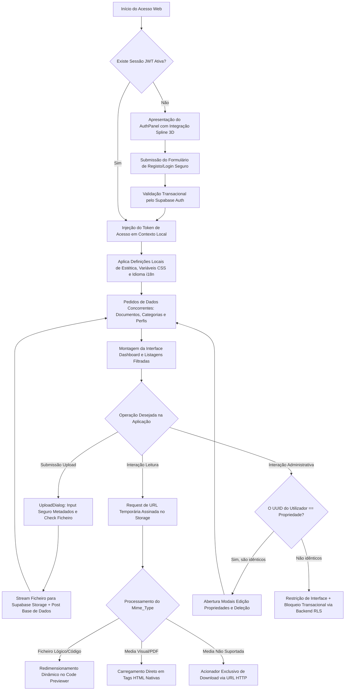

# Manual de Arquitetura e Funcionamento - ETAP Biblioteca

Este documento apresenta a especificação técnica e o manual de funcionamento do sistema ETAP Biblioteca. Foi elaborado para descrever detalhadamente as tecnologias, componentes e fluxos operacionais da aplicação, servindo como guia para programadores e utilizadores.

---

## 1. Descrição Geral do Sistema

A ETAP Biblioteca é uma plataforma web para partilha, organização e centralização de recursos pedagógicos e materiais de estudo. Suporta múltiplos formatos (PDFs, imagens, vídeos, arquivos e código-fonte) com capacidades avançadas de visualização integradas.

Principais pilares da plataforma:
* **Autenticação Institucional:** Acesso restrito a contas com domínio `@etap.pt`.
* **Segurança de Autoria (RLS):** Controlo de permissões rigoroso na base de dados, garantindo que apenas o proprietário pode editar ou remover recursos.
* **Visualização Avançada:** Pré-visualização integrada de ficheiros multimédia e código-fonte diretamente na aplicação, minimizando downloads externos.
* **Internacionalização (i18n):** Suporte nativo e comutável dinamicamente entre múltiplos idiomas (Português e Inglês).
* **Personalização de Interface:** Controlo total e imediato sobre temas estéticos (escuros, claros ou animados), tipos de letra e dimensões textuais.

---

## 2. Pilha Tecnológica (Stack Tecnológico)

Arquitetura moderna de Single Page Application (SPA) com renderização híbrida:

| Componente | Tecnologia | Finalidade e Justificação Técnica |
| :--- | :--- | :--- |
| **Framework Principal** | Next.js 15 (React) | Renderização do lado do cliente (`use client`) e gestão eficiente de dependências num ecossistema moderno focado em performance. |
| **Linguagem** | TypeScript | Tipagem estática, garantindo segurança em tempo de compilação e melhorando a autodescoberta e manutenção do código. |
| **Estilização** | Tailwind CSS | Framework utilitária, perfeitamente acoplada e mapeada por variáveis CSS para permitir alterações e controlos dinâmicos de temas. |
| **Backend as a Service** | Supabase | Infraestrutura integral que fornece Autenticação, Base de Dados relacional PostgreSQL e Storage (armazenamento fiável de objetos físicos). |
| **Biblioteca de Ícones** | Lucide React | Consistência visual através de componentes vetoriais SVG escaláveis e leves. |
| **Visualizador 3D** | Spline Viewer | Integração independente no ecrã inicial para carregamento de modelos 3D interativos e envolventes. |
| **Processamento de Código** | highlight.js & marked | Motores dedicados para deteção e colorização de sintaxe em tempo real (Syntax Highlighting) e renderização de formatações Markdown seguras (GFM). |

---

## 3. Funcionalidades Detalhadas

### 3.1. Gestão e Visualização de Documentos
* **Carregamento (Upload):** Os utilizadores podem transferir ficheiros através de interações clássicas ou *drag-and-drop*. Inclui indicadores visuais de progresso percentual de transferência.
* **Edição e Eliminação:** Apenas o autor original, com a sua conta validada, tem permissão de interface e de base de dados para alterar os metadados (como nome, descrição, categoria, tags) ou apagar o registo definitivo.
* **Visualizador Multimédia Integrado:** 
  * Imagens, vídeos e ficheiros PDF são apresentados nativamente dentro de um modal responsivo (`document-view-dialog.tsx`) não requerendo programas de terceiros.
  * O acesso direto ao ficheiro é intermediado pela geração de "Signed URLs" temporários na API do Supabase Storage. Isto restringe acessos forjados ou atalhos indevidos.

### 3.2. Visualizador Avançado de Código (Code Previewer)
* **Deteção Multi-linguagem:** Identificação inteligente da linguagem pela extensão de ficheiro ou convenção de nome (ex: `Dockerfile`, `Makefile`), abrangendo dezenas de linguagens suportadas pelo `highlight.js`.
* **Modo Expansível (Fullscreen):** Capacidade de expandir as linhas de código com um único clique de forma a preencher virtualmente toda a resolução útil do ecrã (`code-preview-overlay` via overlay), imitando um Editor IDE e suspendendo o rolamento (scroll) da página base.
* **Integração de Markdown:** Para ficheiros `.md`, os utilizadores podem alternar instantaneamente entre a visualização do código-fonte não formatado (*Raw Source*) ou o documento renderizado.
* **Ferramentas de Conveniência:** Integra cópia nativa instantânea para área de transferência (*clipboard*) e botão interativo de formatação para limites de linha (`Word Wrap`).

### 3.3. Pesquisa e Navegação Inteligente
* **Omnibox Dinâmica (Barra de Pesquisa Superior):** A pesquisa verifica paralela e simultaneamente títulos, descrições, extensões, categorias e *tags*. Os resultados preenchem imediatamente uma lista suspensa organizada logicamente.
* **Atalhos e Acessibilidade:** Interface fluída navegável com teclas de direção (`Up/Down`), seleção direta (`Enter`) e retrocesso (`Esc`).
* **Painel Informativo (Sidebar):** Contadores estatísticos que efetuam um inventário e mostram totais (contagem agregada e soma gigabytes) da conta local contra toda a plataforma. 

### 3.4. Internacionalização (i18n) e Definições de Estilo (Settings)
* **Tradução Local:** Recurso ao utilitário interno `useLanguage` suportado pelo inventário `translations.ts` que reflete num instante alterações vocabulares em toda a SPA sem obrigar a refrescos da rede.
* **Memória Temática:** As preferências aplicadas (Tipografia Sans/Serif/Mono, tamanhos padronizados de texto `sm/base/lg` e esquemas visuais com ou sem gradientes animados em background) são mapeadas para o `document.documentElement` em variáveis CSS injetadas em tempo real e imortalizadas localmente via `localStorage`.

---

## 4. Arquitetura de Componentes da Aplicação

### Núcleo de Inicialização e Autenticação
* `layout.tsx` / `page.tsx`: Fundações de entrada do React Next.js, incluindo o *wrapper* base com metadados HTML, classes fundamentais e definições font-face.
* `library-app.tsx`: O cérebro controlador do estado. Deteta a existência de um *Token* do Supabase e encarrega-se do roteamento principal, servindo ecrãs de registo a não autenticados ou ativando a zona de trabalho àqueles com login válido.
* `auth-panel.tsx` / `auth-dialog.tsx`: Formulários completos com submissões em lote à API, tratamento global de respostas de ecrã e *handlers* de verificação de conta ou reset de passwords.

### Interface de Utilização Central (Dashboard)
* `dashboard.tsx`: Gestor da grelha documental de listagem. Sincroniza estados cruzados com o painel lateral para efetuar filtragens e emite `Promises.all` para chamadas eficientes em rede aquando do carregamento da montra de ficheiros e subcategorias.
* `sidebar.tsx`: Acomoda os filtros principais interativos baseados nas *tags* submetidas por toda a plataforma.
* `topbar.tsx`: Contém a zona utilitária superior que engloba perfis de utilizador (`Avatar` interativo e logout) e a pesquisa inteligente.

### Operações e Visualização de Ficheiros
* `document-card.tsx`: Estrutura padronizada (cartão com sombra, rodapé metadados, selos visuais). Expõe interfaces dinâmicas restritas ao autor do ficheiro para aceder a modais de deleção ou gestão de ficheiro.
* `document-view-dialog.tsx`: Um contentor Modal com arquitetura reativa que, perante chamadas de pré-visualização ou downloads, inspeciona o `mime_type` providenciado para despachar o renderizador específico (IFrame PDF, tag de Video, Imagem). Transita elegantemente de metragens estreitas para espaços mais alongados se invocado para visualizar trechos de código.
* `code-preview.tsx`: Focado estritamente na leitura otimizada de linguagens formais e estruturadas. Renderiza via `dangerouslySetInnerHTML` após aplicar *parsers* (Highlight e Marked), controlando localmente estados de visualização integral e quebra de linhas para legibilidade ininterrupta.
* `upload-dialog.tsx`: Valida aspetos estruturais de um pedido de ficheiro como dimensão máxima e preenchimento de campos essenciais (título, descrição, categorias em dropdown), enviando sequencialmente os dados transacionais para o *Storage Bucket* e depois para o *Database Table*.

---

## 5. Persistência de Dados e Segurança do Backend (RLS)

A base de dados Postgres alavancada no Supabase encarrega-se de blindar de forma hermética a segurança global da solução, empregando `Row Level Security` (RLS). Com isto, as API REST em GraphQL tornam-se virtualmente imunes a comandos maliciosos diretos.

**Exemplo das Políticas de Acesso Declaradas:**
```sql
-- 1. Qualquer utilizador autenticado pode consultar materiais (DQL Universal)
CREATE POLICY "Permitir leitura global a utilizadores autenticados" 
ON public.documents FOR SELECT TO authenticated USING (true);

-- 2. Qualquer utilizador autenticado pode inserir novos registos (DML Criação)
CREATE POLICY "Permitir inserção a utilizadores autenticados" 
ON public.documents FOR INSERT TO authenticated WITH CHECK (auth.uid() = owner_id);

-- 3. Apenas o autor do registo pode atualizar ou remover o mesmo (DML Modificação)
CREATE POLICY "Permitir modificação apenas ao proprietário" 
ON public.documents FOR ALL TO authenticated USING (auth.uid() = owner_id) WITH CHECK (auth.uid() = owner_id);
```

As políticas garantem que a modificação dos dados depende de fatores de avaliação da identidade do requerente encriptada no *Token JWT* emitido em cada sessão autenticada.

---

## 6. Fluxo Geral de Navegação e Interação

O diagrama em formato de grafo direcionado aprofunda o processo transacional completo de um utilizador no ecossistema:


```mermaid
graph TD
    A[Início do Acesso Web] --> B{Existe Sessão JWT Ativa?}
    B -- Não --> C[Apresentação do AuthPanel com Integração Spline 3D]
    C --> D[Submissão do Formulário de Registo/Login Seguro]
    D --> E[Validação Transacional pelo Supabase Auth]
    E --> F[Injeção do Token de Acesso em Contexto Local]
    B -- Sim --> F
    F --> G[Aplica Definições Locais de Estética, Variáveis CSS e Idioma i18n]
    G --> H[Pedidos de Dados Concorrentes: Documentos, Categorias e Perfis]
    H --> I[Montagem da Interface Dashboard e Listagens Filtradas]
    I --> J{Operação Desejada na Aplicação}
    J -- Submissão Upload --> K[UploadDialog: Input Seguro Metadados e Check Ficheiro]
    K --> L[Stream Ficheiro para Supabase Storage + Post Base de Dados]
    L --> H
    J -- Interação Leitura --> M[Request de URL Temporária Assinada no Storage]
    M --> N{Processamento do Mime_Type}
    N -- Ficheiro Lógico/Código --> O1[Redimensionamento Dinâmico no Code Previewer]
    N -- Media Visual/PDF --> O2[Carregamento Direto em Tags HTML Nativas]
    N -- Media Não Suportada --> O3[Acionador Exclusivo de Download via URL HTTP]
    J -- Interação Administrativa --> P{O UUID do Utilizador == Propriedade?}
    P -- Sim, são idênticos --> Q[Abertura Modais Edição Propriedades e Deleção]
    Q --> H
    P -- Não idênticos --> R[Restrição de Interface + Bloqueio Transacional via Backend RLS]
```

Este fluxo global traduz a arquitetura defensiva e reativa que o sistema ETAP Biblioteca confere às operações diárias da plataforma, mantendo alta a estabilidade sem sacrificar a flexibilidade estática.
